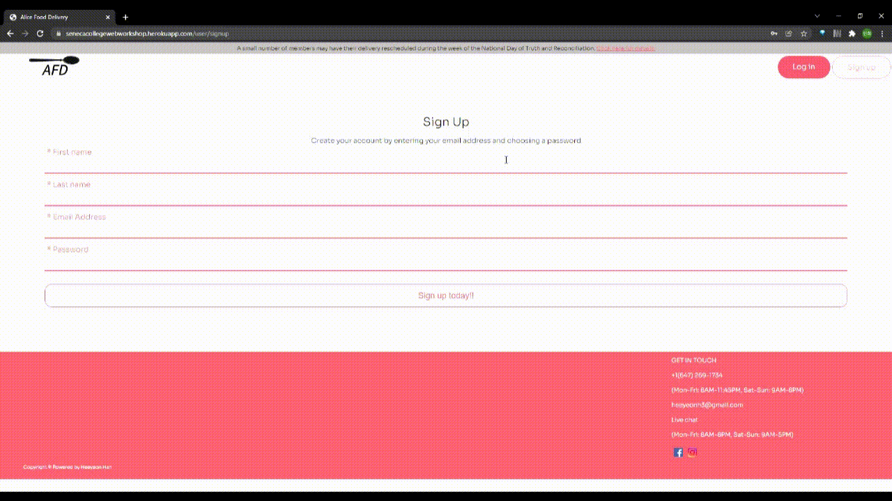

# <a href="https://senecacollegewebworkshop.herokuapp.com/" target="_blank">Alice Food Delivery</a>

 
Alice Food Delivery is the Web application that privides recipes and delivers the ingredients straight to customer door

  
Included User authentication, Email platform for validation code and Success Order / Sign up message, Upload
and Delete food list, Profile, Persistent login

 Link - https://senecacollegewebworkshop.herokuapp.com/
 
## Demo

>Main & Menu Page

>Signup & Login 

>Manage Menu List

>Shopping Cart

>Responsive Design

## Technologies Used

- Html
- CSS
- Javascript
- NodeJs
- HeroKu
- HandlerBars
- MongoDB (Database - User information, Menu list ) 
- SendGrid (Email Platform- Varidation code for changing password, Receipt and Invoice email , Sign up success message )
